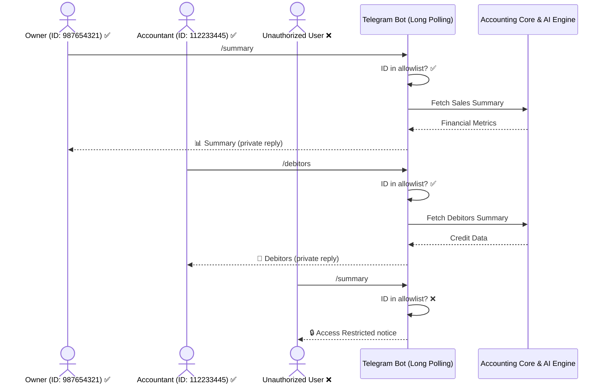

# Telegram Bot Integration & Interactive Command Center

Turn your Telegram Bot into a secure, mobile-friendly **Financial Command Center** for "Hotel Gaurav". The integration enables the restaurant owner (and any trusted team members) to execute ledger operations, view outstanding customer balances, sync spreadsheets in real-time, and converse directly with the **AI Financial Advisor** from anywhere in the world.

---

## 🛠️ Step-by-Step Onboarding Setup

### Step 1: Create Your Telegram Bot

You only need **one bot** for the whole setup — the bot token identifies the bot itself and is shared by all authorized users.

1. Open Telegram and search for the official [@BotFather](https://t.me/BotFather).
2. Start a chat and send the command:
   ```text
   /newbot
   ```
3. Follow the prompts:
   * **Name**: Choose a friendly display name (e.g., `Hotel Gaurav Financial Advisor`).
   * **Username**: Choose a unique username ending in `bot` (e.g., `HotelGauravAdvisorBot`).
4. **Copy the HTTP API Token** provided by BotFather (e.g., `1234567890:ABCdefGhIJKlmNoPQRsTUVwxyZ`). Keep this private!

---

### Step 2: Retrieve Chat IDs (for each authorized user)

The bot enforces a strict **allowlist** — only users whose Chat IDs are listed in `TELEGRAM_CHAT_ID` can interact with it.

For **each person** who should have access:

1. Search for [@userinfobot](https://t.me/userinfobot) on Telegram.
2. Send any message or `/start`.
3. Locate the `id` field in the reply:
   ```json
   "chat": {
     "id": 987654321,
     "first_name": "Raman",
     "type": "private"
   }
   ```
4. Copy this number (e.g., `987654321`).

---

### Step 3: Configure Environment Variables

Open your project's `.env` file at the root directory (`/ai-accounting-automation/.env`) and update with your credentials:

```env
# ====================================================================
# Telegram Interactive Bot Configuration
# ====================================================================
# The bot token from @BotFather — one token shared by all users
TELEGRAM_BOT_TOKEN="1234567890:ABCdefGhIJKlmNoPQRsTUVwxyZ"

# Comma-separated list of authorized Chat IDs
# Single user:
TELEGRAM_CHAT_ID="987654321"

# Multiple users (owner + accountant, for example):
# TELEGRAM_CHAT_ID="987654321,112233445"

# Comma-separated list of standard IANA timezones to format dates in Telegram messages
TELEGRAM_TIMEZONES="Asia/Kolkata,Asia/Hong_Kong,Europe/London"
```

> [!IMPORTANT]
> `TELEGRAM_BOT_TOKEN` is always a single value — it is the identity of the bot, not of any user. `TELEGRAM_CHAT_ID` is the list of people allowed to use it.

> [!WARNING]
> Keep your `TELEGRAM_BOT_TOKEN` secret! Do not commit it to GitHub. The `.gitignore` is already configured to exclude `.env` files.

---

## 👥 Multi-User Access

Multiple people can use the same bot simultaneously. Each authorized user:
- Receives the **startup online notification** when the backend server starts.
- Receives the **sync summary** broadcast after every Drive sync (cron or manual).
- Gets their **own private replies** — if Person A asks `/summary`, Person B does not see A's response.
- Gets **blocked** if their Chat ID is not in the list, with a message explaining how to request access.

To add a second user (e.g., your accountant):
```env
TELEGRAM_CHAT_ID=987654321,112233445
```

---

## 🛡️ Security Architecture

Ledger data is confidential. The bot implements a **strict Chat ID allowlist**:



---

## 📱 Interactive Command Panel

| Command | Keyboard Button | Action | Description |
| :--- | :--- | :--- | :--- |
| `/start` or `/help` | — | Onboarding Card | Welcome card with all commands |
| `/summary` | 📊 Sales Summary | Sub-menu | Opens timeframe selector (today / month / master) |
| `/debitors` | 👥 Debitors List | Ranked Table | Top 5 outstanding debtors with risk flags |
| `/sync` | 🔄 Sync Ledger | Drive Pipeline | Downloads Drive files → audits → updates DB → notifies all users |
| `/status` or `/health` | 🩺 Service Health | Diagnostics | AI provider, model, cron schedule, user count, server time |

### Sales Sub-menu (inline buttons after `/summary`)

| Button | What it shows |
| :--- | :--- |
| 📅 Today's Sales Summary | Latest reconciled business day (Liquor, Food, Expenses, Net) |
| 📅 View Specific Month | Dynamic grid of all months in the ledger, newest first |
| 📊 Master Cumulative Summary | Totals across all audited months |

---

## 🤖 Natural Language AI Chat

You don't need commands — type any question and the bot routes it to the **AI Financial Advisor**:

* *"How did liquor sales compare to food sales last month?"*
* *"Who is our top debtor and what is their collection risk?"*
* *"Suggest a recovery strategy for [Customer Name]"*
* *"Compare sales trends across all months"*

The AI loads the latest sales and debitors summaries, performs mathematical verification, and formats answers as clean Markdown tables in monospaced blocks (properly aligned on Telegram mobile).

---

## 🟢 Startup Notification

When the backend server starts with valid Telegram credentials, all authorized users receive:
```
🟢 Hotel Gaurav AI — Accounting Service Online

🤖 AI Engine: `GROQ` (llama-3.3-70b-versatile)
📅 Auto-Sync Schedule: `30 17 * * *`
👥 Authorized Users: 2

Tap any button below to get started!
```

This confirms the service is live and shows the active configuration at a glance.

---

## 🚀 Running the Bot

The bot is fully integrated into the backend service and starts automatically with:
```bash
npm run dev
```

The console will output:
```text
[Telegram Bot] Starting interactive bot listener loop (Long Polling)...
[SERVER] Fastify HTTP server listening for requests
```

On cloud providers like Render, the long polling loop runs continuously in the background alongside the health check endpoint — no SSL certificates or `ngrok` tunnels needed.
