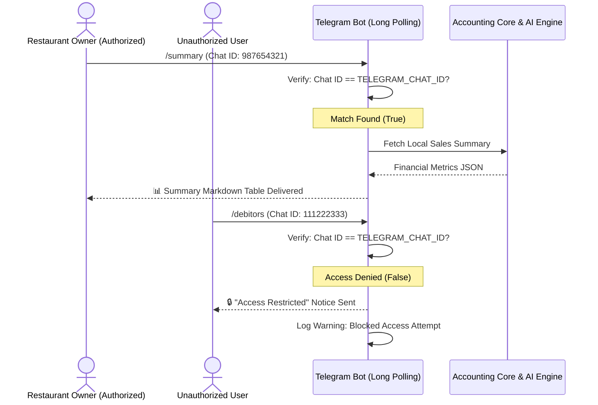

# Telegram Bot Integration & Interactive Command Center

Turn your Telegram Bot into a secure, mobile-friendly **Financial Command Center** for "Hotel Gaurav". The integration enables the restaurant owner to execute ledger operations, view outstanding customer balances, sync spreadsheets in real-time, and converse directly with the **AI Financial Advisor** from anywhere in the world.

---

## 🛠️ Step-by-Step Onboarding Setup

### Step 1: Create Your Telegram Bot
To talk to Telegram, you need to create a bot account and obtain a unique API Token.

1. Open Telegram and search for the official [@BotFather](https://t.me/BotFather).
2. Start a chat and send the command:
   ```text
   /newbot
   ```
3. Follow the prompts:
   * **Name**: Choose a friendly display name (e.g., `Hotel Gaurav Financial Advisor`).
   * **Username**: Choose a unique username ending in `bot` (e.g., `HotelGauravAdvisorBot`).
4. **Copy the HTTP API Token** provided by BotFather (e.g., `1234567890:ABCdefGhIJKlmNoPQRsTUVwxyZ`). Keep this private!

---

### Step 2: Retrieve Your Personal Chat ID
For security, the bot **only** responds to you. You need to retrieve your unique numeric Chat ID.

1. Search for [@userinfobot](https://t.me/userinfobot) on Telegram.
2. Send any message or `/start`.
3. Locate the `id` field under the `chat` object in the JSON reply:
   ```json
   "chat": {
     "id": 987654321,
     "first_name": "Raman",
     "type": "private"
   }
   ```
4. Copy this number (e.g., `987654321`).

---

### Step 3: Configure Environment Variables

Open your project's `.env` file at the root directory (`/ai-accounting-automation/.env`) and update the mock values with your authentic credentials:

```bash
# ====================================================================
# Telegram Interactive Bot Configuration
# ====================================================================
# Paste the API Token from @BotFather
TELEGRAM_BOT_TOKEN="your_copied_bot_token_here"

# Paste your personal numeric Chat ID from @RawDataBot (e.g. 987654321)
TELEGRAM_CHAT_ID="your_personal_chat_id_here"
```

> [!WARNING]
> Keep your `TELEGRAM_BOT_TOKEN` secure! Do not commit it to version control systems like GitHub. The `.gitignore` is already configured to exclude `.env` files.

---

## 🛡️ Security Architecture

Ledger data is highly confidential. To prevent unauthorized users from querying "Hotel Gaurav's" restaurant sales, profit margins, or debtor records, we have implemented a **Strict Chat ID Verification Policy**:



If an unauthorized user attempts to message the bot, the bot logs a warning block on the server and replies to the attacker with an **Access Restricted** card, withholding all ledger details.

---

## 📱 Interactive Command Panel

Our bot includes custom slash commands that respond instantly with formatted financial data.

| Command | Action | Output Style | Description |
| :--- | :--- | :--- | :--- |
| `/start` or `/help` | Onboarding Card | Rich Text + Emojis | Displays welcome card and a pocket guide of all available commands. |
| `/summary` | Sales Summary | Premium Key-Value list | Extracts audited Daily Sales, Food/Liquor revenue splits, cashflow position, and best months. |
| `/debitors` | Outstanding Debts | Ranked Markdown Table | Extracts outstanding debit aggregates (Udhari) and ranks top 5 debtors with risk flags. |
| `/sync` | Force Ingestion | Dynamic Status + Alert | Fetches latest spreadsheets from Google Drive, triggers rules-audits, compiles models, and updates web portal. |
| `/status` or `/health` | Server Inspection | Diagnostics Card | Inspects active AI Provider (e.g. Groq), model version, cron scheduler pattern, and server health. |

---

## 🤖 Natural Language AI Chat Companion

You don't need to memorize commands! If you type a standard question, the bot redirects your query to the **AI Financial Advisor**, backed by Groq or Gemini:

### Try Asking:
* *“How did liquor sales do compared to food sales last month?”*
* *“Who is our top debtor and what is their collection risk?”*
* *“Suggest a recovery strategy for [Customer Name]”*
* *...
* *“Compare sales trends across all months parsed”*

The AI engine automatically loads the **latest daily sales registers** and **debtors lists**, performs a strict mathematical verification, formats comparisons as clean Markdown tables, and outputs actionable business recommendations!

---

## 🚀 Execution & Management

### Local Development
The bot is fully integrated into the backend service boot sequence. To run the app locally in development watch mode:
```powershell
npm run dev
```
The console will output:
```text
[Telegram Bot] Starting interactive bot listener loop (Long Polling)...
[SERVER] HTTP health-check server listening for requests on port 8080
```

### Production Deployment
When deploying to cloud providers like Railway, Render, or Heroku, the long polling loop runs continuously in the background alongside the lightweight HTTP health check endpoint, eliminating the need for complex SSL certificates or reverse tunnels (like `ngrok`).
