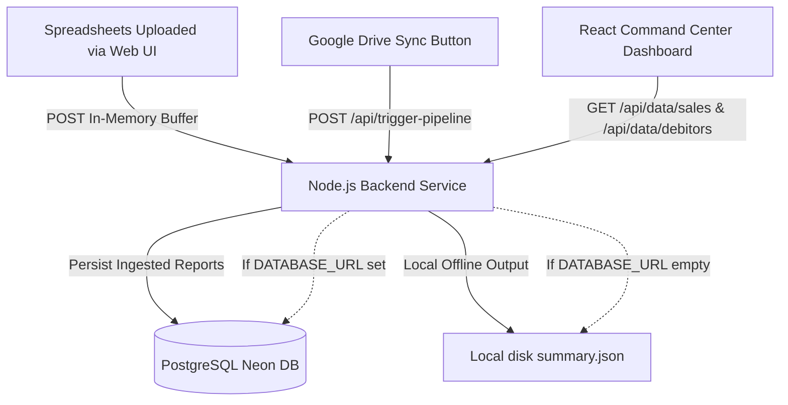

# AI Accounting Automation — Financial Command Center Dashboard

A high-fidelity, production-grade executive dashboard for real-time accounting verification, anomaly auditing, and business intelligence insights from financial registers. Connects live to the Node.js backend API which reads from a PostgreSQL (Neon) database or local disk files.

---

## 🚀 Architecture Overview

This application operates on a modern, secure client-server architecture:
- **Frontend**: Built using React, TypeScript, Vite, and Tailwind CSS v4 with shadcn/ui components.
- **Backend Node.js Service**: Serves as the ingestion and orchestration engine, parsing actual Excel registers, executing anomaly-detection rules, and persisting data dynamically to PostgreSQL (Neon DB).



---

## 📊 Data Integration & Sync Flow

### 1. Dual-Mode Data Architecture
The React application syncs data with the Node.js backend using a clean dual-storage configuration:
- **Live Database Mode** (Active if `DATABASE_URL` is set in the backend `.env`): The frontend queries `GET /api/data/sales` and `GET /api/data/debitors` which pull directly from the Neon PostgreSQL database. If the database has no data yet, the API returns a 404 and the frontend displays the onboarding dashboard with upload controls active. **No mock fallbacks or simulated stats are shown in production when the database is empty.**
- **Offline Local File Mode** (Active if `DATABASE_URL` is omitted in backend): The backend reads reports directly from local disk (`data/output/.../summary.json`), supporting offline-first local audits without any cloud dependency.

The frontend detects which mode is active based on the API response and displays a `LIVE DB` or `Local Files` badge in the sidebar accordingly.

### 2. Google Drive Sync
The **Sync Drive** button in the header triggers `POST /api/trigger-pipeline`, which instructs the backend to:
1. Download all Excel ledgers from the configured Google Drive folder.
2. Parse, audit, and run AI analysis on each workbook.
3. Persist the results to Neon DB (if `DATABASE_URL` is set).
4. Send a Telegram executive brief to the configured chat ID.
5. Return updated data — the frontend auto-reloads on success.

### 3. Sequential Multi-Spreadsheet Uploader
The interface includes a drag-and-drop file upload dialog:
- Select multiple ledger spreadsheets (Daily Sales Registers and Debitors Lists) simultaneously.
- An editable upload queue lets you review or remove workbooks before sending.
- Files are parsed sequentially in a non-blocking queue loop to prevent memory spikes, with real-time progress indicators (e.g. `Uploading: File 1 of 2: sales.xlsx`).
- On success, the dashboard reloads automatically with the freshly parsed data.

### 4. Loading Synchronization
On mount, the dashboard runs a background fetch to determine connection status and data availability. A modern spinner screen is displayed until the API responds, preventing layout flashes.

---

## 🛠 Key Features

### 📊 Dual-Ledger Portal (Home)
- **Overview Cards**: Two portal cards (Sales Register, Customer Debitors) with live data status, alert counts, and sparkline trend previews.
- **Connection Indicator**: Sidebar badge shows `LIVE DB` or `Local Files` connection mode.
- **Cron Schedule Display**: Shows the next scheduled auto-sync time from the backend cron configuration.

### 📈 Executive Overview
- **Dynamic KPIs**: Track Net Surplus, Credit Recovery split, and Clearance Indexes derived directly from parsed Excel data.
- **Interactive Time-Series Charts**: View cashflow timelines and vertical ageing splits using Recharts.
- **Outreach Copy Triggers**: Copy personalized SMS/WhatsApp payment reminder drafts directly from outstanding accounts.

### 🗃 Transaction Ledger Explorer
- **Record Inspection**: Drill down into detailed ledger sheets with full pagination.
- **Live Search & Filter**: Refine records by customer names, months, or credit thresholds.
- **Client-Side CSV Exporter**: Compile and download audited rows to a formatted CSV spreadsheet file matching your active filters.

### 🚨 Audit Anomaly Board
- **Security Exceptions**: Tracks structural issues (credit breaches, excessive category spending).
- **Rule Limits Configurator**: Live sliders adjust the compliance boundaries, recalculating active exceptions on the fly.
- **One-click Acknowledgements**: Resolve or reopen issues with instant toast feedback.

### 💬 AI Strategic Advisor
- **Contextual Ledger Chat**: Ask questions about top debtors or spending spikes. The advisor generates responses using real parsed metrics via `POST /api/chat`.
- **Offline Heuristic Fallback**: If the backend AI is unreachable, a local data-driven heuristic engine generates meaningful answers from the already-loaded ledger summary.

### 🔐 Security & Access Control
- **Fullscreen App Lock Screen**: Displays a security lock overlay upon mounting. Users must verify their passcode on the backend (creating a browser `sessionStorage` token) before viewing the dashboard metrics.
- **Upload Passcode Gate**: Form submissions for ledger uploads require a correct ingestion password to prevent unauthorized spreadsheet uploads.
- **Tabbed Security console**: Features a dedicated settings console to update credentials in the Neon PostgreSQL database using **argon2 password hashing** on the backend. Provides side-by-side tabs for updating the App Lock passcode or the Upload passcode independently with confirmation mismatch verification and password visibility toggles (`Eye`/`EyeOff`).

---

## 💻 Tech Stack

| Layer | Technology | Version |
| :--- | :--- | :--- |
| Core Framework | React | ^19.2.4 |
| Build Tool | Vite | ^7.3.1 |
| Language | TypeScript | ~5.9.3 |
| Styling | Tailwind CSS v4 | ^4.2.1 |
| UI Components | shadcn/ui + Base UI | ^4.8.0 |
| Charts | Recharts | ^3.8.1 |
| Icons | Lucide React | ^1.16.0 |
| Toast Notifications | Sonner | ^2.0.7 |
| Theme | next-themes | ^0.4.6 |
| Markdown Rendering | marked | ^18.0.4 |

---

## ⚙ Setup & Development

### 1. Configure Environment Variables
Create a `.env` file in the `web/` directory (copy `.env.example` as a template):
```bash
cp .env.example .env
```
Set `VITE_API_BASE_URL` to point to your local or deployed backend:
```env
VITE_API_BASE_URL=http://localhost:8080
```
For Vercel production, set this to your deployed Render backend URL (e.g. `https://your-app.onrender.com`).

### 2. Install Dependencies
Run from the `web/` directory:
```bash
npm install
```

### 3. Run Development Server
Launches the interactive dashboard locally:
```bash
npm run dev
```
The app will be available at `http://localhost:5173` by default.

### 4. Build Production Bundle
Statically compiles and tree-shakes TypeScript code for deployment:
```bash
npm run build
```

---

## 🌐 Vercel Deployment

Deploy the frontend to Vercel with one environment variable:

| Variable | Value | Required |
| :--- | :--- | :--- |
| `VITE_API_BASE_URL` | Your Render backend URL (e.g. `https://your-api.onrender.com`) | **Yes** |

> [!IMPORTANT]
> Vercel builds with `npm run build`. Make sure `VITE_API_BASE_URL` is set **before** deploying — Vite bakes it into the static bundle at build time. If you update the backend URL, you must trigger a re-deploy.

> [!NOTE]
> CORS is handled by the backend. The backend's `cors.ts` already allows all origins (`*`), so no additional Vercel configuration is needed for cross-origin requests.
