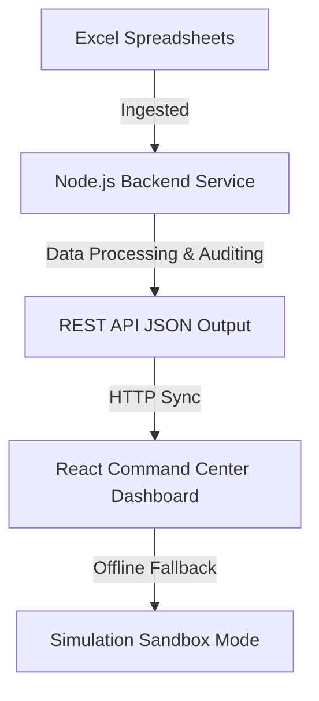

# Hotel Gaurav: Financial Command Center Dashboard

A high-fidelity, production-grade executive dashboard designed for real-time accounting verification, anomaly auditing, and business intelligence insights from Hotel Gaurav's financial registers.

---

## 🚀 Architecture Overview

This application operates on a modern client-server architecture:
- **Frontend**: Built using React, TypeScript, Vite, Tailwind CSS, and shadcn/ui.
- **Backend Node.js Service**: Serves as the ingestion and orchestration engine, parsing actual Excel registers and running programmatic anomaly-detection rules.



---

## 📊 Data Integration & Sync Flow

### 1. Live Server Integration
Upon mounting, the React application initiates connection requests to the backend server (`http://localhost:8080/api/data/sales` and `/api/data/debitors`):
- It fetches the consolidated data parsed directly from:
  - `Hotel Gaurav Daily Sales Register.xlsx`
  - `Hotel Gaurav Debitors Outstanding List.xlsx`
- Programmatic totals, monthly inflow/outflow sheets, and top-priority outstanding dues are computed in real-time by the service.

### 2. Auto-Recovery & Resilient 3-Tier Sync Fallback
If the backend server is offline or unreachable, the application falls back through a highly resilient three-tier data synchronization architecture:
1. **Tier 1: Live API (Active Sync)**: Queries the backend node service directly to get the freshest data calculated in real-time.
2. **Tier 2: Static Sync (Real Offline)**: If the backend is offline, the React app automatically queries the frontend's local server assets `/data/sales-summary.json` and `/data/debitors-summary.json`. These are real, static datasets generated and written directly by the ingestion service the last time it ran.
3. **Tier 3: Simulation Mock**: If static JSONs are unavailable, it defaults to embedded snapshot code mocks to ensure absolute preview stability and interactive demoing.

---

## 🛠 Key Features

### 📈 Executive Overview
- **Dynamic KPIs**: Track Net Surplus, Credit Recovery split, and Clearance Indexes.
- **Interactive Time-Series**: View vertical ageing splits for liabilities or cashflow timelines using Recharts charts.
- **Outreach copy triggers**: Copy personalized SMS/WhatsApp payment reminder drafts directly from outstanding accounts.

### 🗃 Transaction Ledger Explorer
- **Record Inspection**: Drill down into detailed ledger sheets with full pagination.
- **Live Search & Filter**: Refine records by customer names, months, or credit thresholds.
- **Client-Side CSV Exporter**: Compile and download audited rows to a formatted CSV spreadsheet file matching your active filters.

### 🚨 Audit Anomaly Board
- **Security exceptions**: Tracks structural issues (credit breaches, excessive category spending).
- **Rule Limits Configurator**: Live sliders adjust the compliance boundaries, recalculating active exceptions on the fly.
- **One-click Acknowledgements**: Resolve or reopen issues with instant toast feedback.

### 💬 AI Strategic Advisor
- **Contextual ledger chat**: Ask questions about top debtors or spending spikes. The advisor generates responses using real parsed metrics.

---

## 💻 Tech Stack
- **Core**: React 19 (v19.2.4), Vite 7 (v7.3.1), TypeScript (v5.9.3)
- **Styling**: Tailwind CSS v4 (v4.2.1), shadcn/ui components (v4.8.0)
- **Feedback**: Sonner (Toast notifications positioned top-right) (v2.0.7)
- **Charts**: Recharts (fully responsive canvas elements) (v3.8.1)
- **Icons**: Lucide React (v1.16.0)

---

## ⚙ Setup & Development

### 1. Install Dependencies
Run from the `web` workspace directory:
```bash
npm install
```

### 2. Run Development Server
Launches the interactive dashboard locally:
```bash
npm run dev
```

### 3. Build Production Bundle
Statically compiles and tree-shakes typescript code:
```bash
npm run build
```
