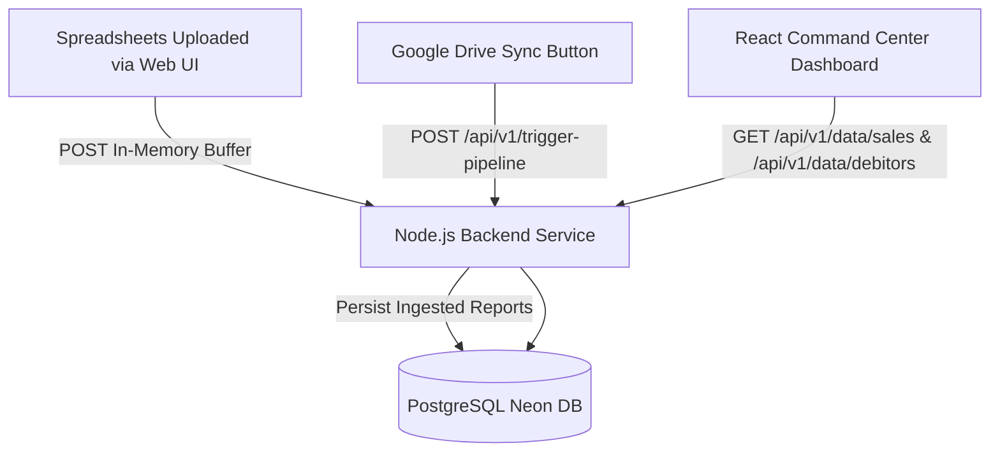

# AI Accounting Automation — Financial Command Center Dashboard

> **Last Updated**: June 14, 2026

A high-fidelity, production-grade executive dashboard for real-time accounting verification, anomaly auditing, and business intelligence insights from financial registers. Connects live to the Node.js backend API which reads directly from a PostgreSQL (Neon) database.

---

## 🚀 Architecture Overview

This application operates on a modern, secure client-server architecture:
- **Frontend**: Built using React, TypeScript, Vite, and Tailwind CSS v4 with shadcn/ui components.
- **Backend Node.js Service**: Serves as the ingestion and orchestration engine, parsing Excel registers, executing anomaly-detection rules, and persisting data dynamically to PostgreSQL (Neon DB).


```mermaid
graph TD
    UserUpload[Spreadsheets Uploaded via Web UI] -->|POST In-Memory Buffer| Node[Node.js Backend Service]
    DriveSync[Google Drive Sync Button] -->|POST /api/v1/trigger-pipeline| Node
    Node -->|Persist Ingested Reports| NeonDB[(PostgreSQL Neon DB)]
    ReactApp[React Command Center Dashboard] -->|GET /api/v1/data/sales & /api/v1/data/debitors| Node
    Node --> NeonDB
```

---

## 📊 Data Integration & Sync Flow

### 1. Relational Database Architecture
The React application syncs data with the Node.js backend using a clean database-first configuration:
- **Live Database Mode**: The frontend queries `/api/v1/data/sales` and `/api/v1/data/debitors` which pull directly from the PostgreSQL database. If the database has no data yet, the API returns a 404 and the frontend displays the onboarding dashboard with upload controls active. **No mock fallbacks or simulated stats are shown in production when the database is empty.**

When the backend API is connected and reachable, the frontend initializes in `live` mode and fetches data registers concurrently. If the backend is completely unreachable, the console enters an offline `empty` state, launching a setup onboarding overlay. Under this offline mode, the advisor chat operates via a local simulated heuristic reasoning engine for demonstration purposes, and the AI Recommendations card displays a "Simulated Demo" badge.

### 2. Google Drive Sync
The **Sync Drive** button in the header triggers `POST /api/v1/trigger-pipeline`, which instructs the backend to:
1. Download all Excel ledgers from the configured Google Drive folder.
2. Parse, audit, and run AI analysis on each workbook.
3. Persist the results to the PostgreSQL DB.
4. Send a Telegram executive brief to the configured chat ID.
5. Return updated data — the frontend auto-reloads on success.

### 3. Sequential Multi-Spreadsheet Uploader
The interface includes a drag-and-drop file upload dialog:
- Select multiple ledger spreadsheets (Daily Sales Registers and Debitors Lists) simultaneously.
- An editable upload queue lets you review or remove workbooks before sending.
- Files are parsed sequentially in a non-blocking queue loop to prevent memory spikes, with real-time progress indicators (e.g. `Uploading: File 1 of 2: sales.xlsx`).
- On success, the dashboard reloads automatically with the freshly parsed data.

### 4. Loading Synchronization
On mount, the dashboard runs a background fetch to determine connection status and data availability. A modern spinner screen is displayed until the API responds, preventing layout flashes.

---

## 📁 Project Directory Structure

```
web/
├── public/                       # Static public assets
├── src/
│   ├── assets/                   # Local image and media assets
│   ├── components/               # React UI & page section components
│   │   ├── layout/               # Main layout components (AppSidebar, Header, LoadingScreen)
│   │   ├── sections/             # Dashboard section interfaces (portal, overview, ledger, auditor, advisor)
│   │   ├── security/             # Security lock screen, credentials settings modal, and history retention modal
│   │   ├── shared/               # Shared onboarding/upload wizard modals (OnboardingWizard, UploadModal)
│   │   └── ui/                   # Primitive layout components (card, button, input)
│   ├── hooks/                    # Custom React hooks
│   │   ├── use-mobile.ts         # Viewport size detector hook
│   │   ├── useAccountingData.ts  # Cascading backend fetching hook
│   │   ├── useDriveSync.ts       # Drive sync status tracking hook
│   │   └── useManualUpload.ts    # Manual uploader queue hook
│   ├── lib/
│   │   └── utils.ts              # Tailwind CSS merging utility
│   ├── providers/                # Theme and app providers
│   │   └── theme-provider.tsx    # Tailwind dark/light theme context provider
│   ├── services/
│   │   └── api.ts                # Client API wrappers with auth fetch
│   ├── store/
│   │   └── useAccountingStore.ts # Zustand global state manager
│   ├── types/                    # Frontend specific type subfolders
│   │   └── ingestion.ts          # Ingestion queue and state types
│   ├── utils/
│   │   ├── business.ts           # Business name filename-to-display converter
│   │   ├── format.ts             # Currency, date, percentage formatters
│   │   └── markdown.tsx          # Custom safe regex-based block tokenizer
│   ├── types.ts                  # Shared frontend types
│   ├── App.tsx                   # Main routing hub
│   ├── index.css                 # Global styles and tailwind directives
│   └── main.tsx                  # Vite React app entrypoint
├── components.json               # Config for shadcn UI component installer
├── eslint.config.js              # Code linting rules configuration
├── index.html                    # Dashboard main HTML container template
├── package.json                  # Scripts and package manifests
├── tsconfig.json                 # Type compiler configurations
└── vite.config.ts                # Bundling and path alias settings
```

---

## 🛠 Key Features

### 📊 Multi-Workspace Command Center Portal (Home)
- **Overview Cards**: Four workspace portal cards (**Daily Sales Register, Customer Debitors (Udhari), Godown Stock, and Counter Stock**) with live data statuses, alert indicators, and sparkline trend previews.
- **Cron Schedule Display**: Shows the next scheduled auto-sync time from the backend cron configuration.

### 📈 Executive Overview
- **Dynamic KPIs**: Track Net Surplus, Credit Recovery split, stock valuations, and Clearance Indexes derived directly from parsed Excel data.
- **Interactive Time-Series Charts**: View cashflow timelines, product cost-vs-selling trends, and dynamic priority debt risk splits using Recharts.
- **Outreach Copy Triggers**: Copy personalized SMS/WhatsApp payment reminder drafts directly from outstanding accounts.

### 🗃 Transaction Ledger Explorer
- **Record Inspection & Double-Tab Layout**: Switch between aggregated summaries (monthly sales ledgers / customer debt ranks / stock lists) and the **Raw Transactions Ledger** grid.
- **Raw Transaction Grid**: Direct row-level grid view showcasing individual records (Date, Category, Invoice ID, Amount, Type, Vendor/Payee, Particulars).
- **Interactive Click Drilldowns**: Click on any monthly ledger row or customer outstanding debt row to slide out a drawer detailing a pre-filtered list of all corresponding raw transactions.
- **Live Search & Filter**: Refine records by customer names, months, categories, transaction types, or credit thresholds.
- **Client-Side CSV Exporter**: Compile and download audited rows to a formatted CSV spreadsheet file matching your active filters.

### 🚨 Audit Anomaly Board
- **Security & Stock Exceptions**: Tracks structural issues (credit breaches, excessive category spending, negative stock levels, out-of-stock items, negative cost-to-sell margin alerts).
- **Rule Limits Configurator Sliders**: Active sliders dynamically adjust compliance policies (High Outflow Ceiling, Category Spike Multiplier, and Outstanding Credit Cap limits) on the fly, saving preferences to the Postgres database.
- **One-click Acknowledgements**: Resolve or reopen issues with instant toast feedback.

### 💬 AI Strategic Advisor
- **Contextual Ledger & Inventory Chat**: Ask questions about top debtors, category spending spikes, or stock movement. The advisor generates responses using real parsed metrics via `/api/chat`.
- **Isolated Workspace History**: Isolates chat logs by workspace type so Counter Stock inquiries do not clutter Godown Stock or Daily Sales sessions.
- **Offline Heuristic Fallback**: If the backend AI is unreachable, a local data-driven heuristic engine generates meaningful answers from the already-loaded ledger summary.

### 🔐 Security, Access Control & Retention Config
- **Fullscreen App Lock Screen**: Displays a security lock overlay upon mounting. It dynamically validates session health with the backend using secure, **bank-grade HttpOnly cookies** (`app_session_token`) completely invisible to client-side scripts (immune to XSS session-theft), with optional **"Remember this device"** 7-day duration scaling.
- **Upload Passcode Gate**: Form submissions for ledger uploads require a correct ingestion password, utilizing an in-memory scoped token inside the component to prevent persistent XSS exposure and remain immune to CSRF.
- **Tabbed Security Console**: Features a dedicated settings console to update credentials in the Neon PostgreSQL database. Provides side-by-side tabs for updating the App Lock passcode or the Upload passcode independently.
- **History Retention Configurator Modal**: Sidebar button launches a configuration modal to set historical data retention windows for different workspaces (e.g., "Latest Only" or custom durations in days like 30, 60, or 90 days), persisting them directly to the database.

### ⚡ Performance & Optimization
- **Rollup Manual Chunks Splitting**: Heavy dependencies like `recharts` and `d3` are compiled into their own distinct cached assets, preventing them from blocking the initial Lock Screen and load loops.
- **React Lazy Loading**: View sections (Overview, Ledger, Auditor, Advisor) and security modals are imported asynchronously using React `lazy` + `Suspense`.
- **Shared Workspace Types**: Domain models (`Alert`, `ParsingError`, etc.) are imported directly from the backend types folder via `@backend-types` Vite path alias, preventing type drift.

---

## 💻 Tech Stack

| Layer | Technology | Version |
| :--- | :--- | :--- |
| Core Framework | React | ^19.2.4 |
| Build Tool | Vite | ^7.3.1 |
| Language | TypeScript | ~5.9.3 |
| Styling | Tailwind CSS v4 | ^4.2.1 |
| UI Components | shadcn/ui + Base UI | ^4.8.0 |
| Charts | Recharts | ^3.8.1 |
| Icons | Lucide React | ^1.16.0 |
| Toast Notifications | Sonner | ^2.0.7 |
| State Management | Zustand | ^5.0.13 |
| Theme | Custom ThemeProvider | (Internal `components/theme-provider.tsx`) |
| Markdown Rendering | Custom SafeMarkdown | (Internal `utils/markdown.tsx`) |

---

## ⚙ Setup & Development

### 1. Configure Environment Variables
Create a `.env` file in the `web/` directory (copy `.env.example` as a template):
```bash
cp .env.example .env
```
Set `VITE_API_BASE_URL` to point to your local or deployed backend:
```env
VITE_API_BASE_URL=http://localhost:8080
```
For Vercel production, set this to your deployed Render backend URL (e.g. `https://your-app.onrender.com`).

### 2. Install Dependencies
Run from the `web/` directory:
```bash
npm install
```

### 3. Run Development Server
Launches the interactive dashboard locally:
```bash
npm run dev
```
The app will be available at `http://localhost:5173` by default.

### 4. Build Production Bundle
Statically compiles and tree-shakes TypeScript code for deployment:
```bash
npm run build
```

---

## 🌐 Vercel Deployment

Deploy the frontend to Vercel with one environment variable:

| Variable | Value | Required |
| :--- | :--- | :--- |
| `VITE_API_BASE_URL` | Your Render backend URL (e.g. `https://your-api.onrender.com`) | **Yes** |

> [!IMPORTANT]
> Vercel builds with `npm run build`. Make sure `VITE_API_BASE_URL` is set **before** deploying — Vite bakes it into the static bundle at build time. If you update the backend URL, you must trigger a re-deploy.

> [!NOTE]
> CORS is handled by the backend using `@fastify/cors` dynamically registered in [fastify.app.ts](file:///d:/1.WORK/PROJECTS/NODEJS/ai-accounting-automation/src/api/fastify.app.ts). It allows requests from localhost/127.0.0.1 and domains explicitly listed in the `.env` configuration parameter `ALLOWED_ORIGINS`.
